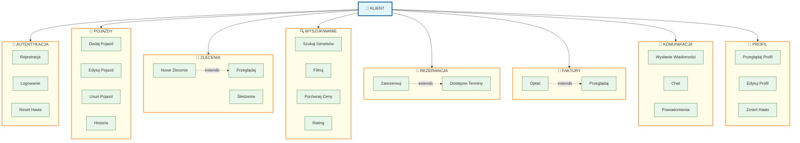
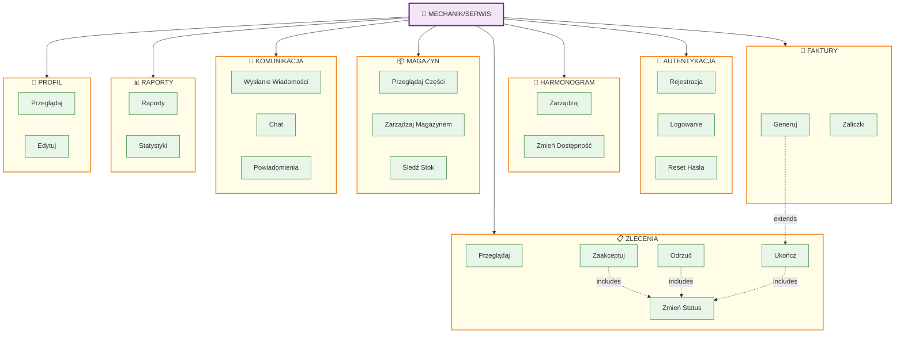
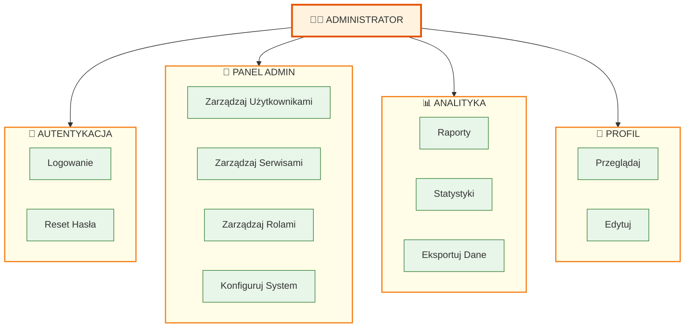
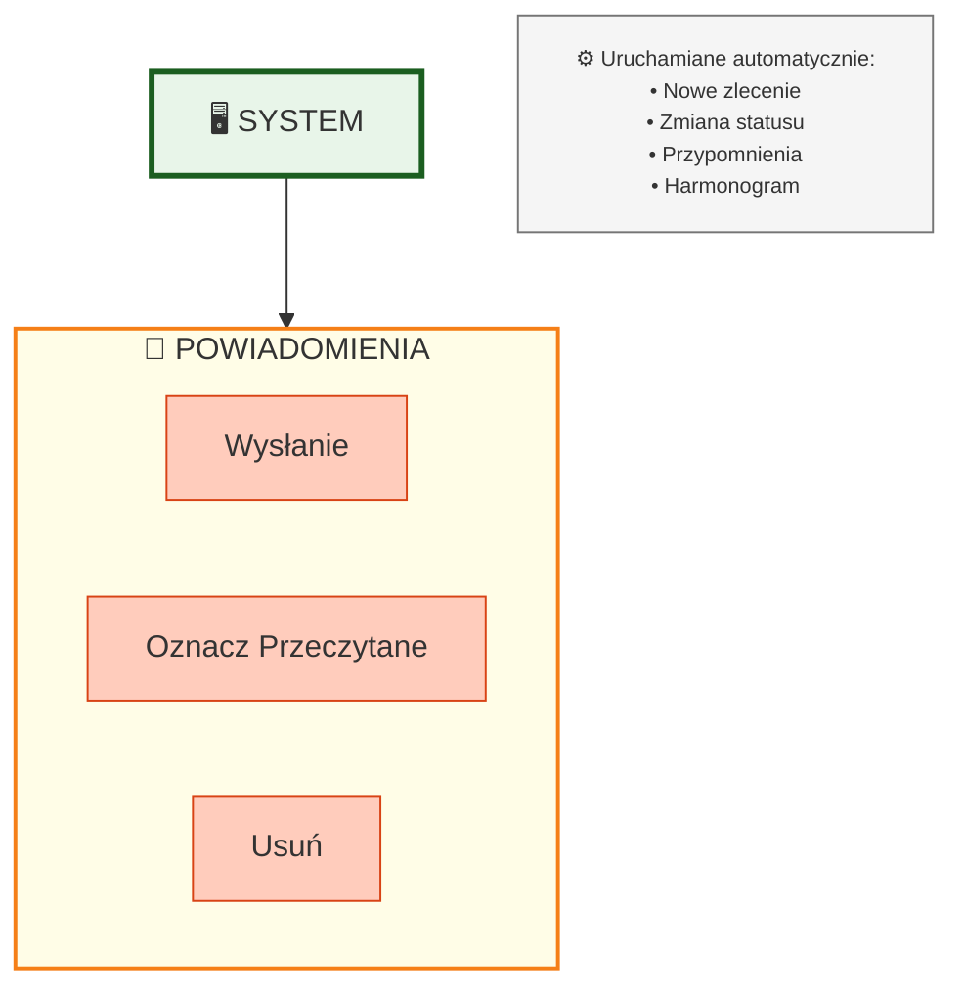

# 📊 DIAGRAM PRZYPADKÓW UŻYCIA (Use Case Diagrams) - WERSJA 2

**Projekt**: AutoRepair - Platforma do zarządzania naprawami samochodów  
**Data**: Luty 2026  
**Ulepszona wersja**: Podzielona na 4 czytelne diagramy

---

---

## 🎯 PRZEGLĄD

Zamiast jednego dużego, nieczytelnego diagramu, poniżej znajdują się 5 osobnych diagramów:
- 📊 Diagram 0️⃣: **OGÓLNY** (Wszystkie UC i aktorzy)
- 📊 Diagram 1️⃣: **KLIENT** (24 UC)
- 📊 Diagram 2️⃣: **MECHANIK/SERWIS** (28 UC)
- 📊 Diagram 3️⃣: **ADMINISTRATOR** (16 UC)
- 📊 Diagram 4️⃣: **SYSTEM** (2 UC)

---

## 📊 DIAGRAM 0️⃣: OGÓLNY - WSZYSTKIE PRZYPADKI UŻYCIA

```mermaid
graph TD
    subgraph Actors["👥 AKTORZY"]
        Client["👤 KLIENT"]
        Mechanic["🔧 MECHANIK"]
        Admin["👨‍💼 ADMIN"]
        System["🖥️ SYSTEM"]
    end
    
    subgraph Categories["📋 KATEGORIE UC"]
        Auth["🔐 AUTENTYKACJA<br/>UC1-3"]
        Vehicle["🚗 POJAZDY<br/>UC5-8"]
        Order["🔧 ZLECENIA<br/>UC9-14"]
        Search["🔍 WYSZUKIWANIE<br/>UC15-18"]
        Booking["📅 REZERWACJA<br/>UC19-20"]
        Invoice["📄 FAKTURY<br/>UC23-26"]
        Message["💬 WIADOMOŚCI<br/>UC27-29"]
        Notif["🔔 POWIADOMIENIA<br/>UC30-32"]
        Parts["📦 MAGAZYN<br/>UC40-42"]
        AdminPanel["👥 ADMINISTRACJA<br/>UC36-39"]
        Analytics["📊 ANALITYKA<br/>UC33-35"]
        Profile["👤 PROFIL<br/>UC43-45"]
    end
    
    Client -->|Dostęp| Auth
    Client -->|Dostęp| Vehicle
    Client -->|Dostęp| Order
    Client -->|Dostęp| Search
    Client -->|Dostęp| Booking
    Client -->|Dostęp| Invoice
    Client -->|Dostęp| Message
    Client -->|Dostęp| Notif
    Client -->|Dostęp| Profile
    
    Mechanic -->|Dostęp| Auth
    Mechanic -->|Dostęp| Order
    Mechanic -->|Dostęp| Booking
    Mechanic -->|Dostęp| Invoice
    Mechanic -->|Dostęp| Message
    Mechanic -->|Dostęp| Notif
    Mechanic -->|Dostęp| Parts
    Mechanic -->|Dostęp| Analytics
    Mechanic -->|Dostęp| Profile
    
    Admin -->|Dostęp| Auth
    Admin -->|Dostęp| AdminPanel
    Admin -->|Dostęp| Analytics
    Admin -->|Dostęp| Profile
    
    System -->|Generuje| Notif
    
    classDef actors fill:#e1f5ff,stroke:#01579b,stroke-width:2px
    classDef categories fill:#fffde7,stroke:#f57f17,stroke-width:2px
    classDef client fill:#e3f2fd,stroke:#1565c0,stroke-width:1px
    classDef mechanic fill:#f3e5f5,stroke:#6a1b9a,stroke-width:1px
    classDef admin fill:#fff3e0,stroke:#e65100,stroke-width:1px
    classDef system fill:#e8f5e9,stroke:#1b5e20,stroke-width:1px
    
    class Actors actors
    class Categories categories
    class Client client
    class Mechanic mechanic
    class Admin admin
    class System system
```

**Statystyka**:
- ✅ **45 Przypadków Użycia** (UC1-UC45)
- ✅ **4 Aktorów** z pełnym dostępem
- ✅ **12 Kategorii Funkcjonalności**
- ✅ **Logiczne relacje** między komponentami

---

## 📊 DIAGRAM 1️⃣: KLIENT (Customer)

**Liczba UC**: 24  
**Główne funkcjonalności**: Zarządzanie pojazdem, wyszukiwanie serwisu, rezerwacja, płatności, komunikacja

---

## 📊 DIAGRAM 2️⃣: MECHANIK/SERWIS (Service Worker)

**Liczba UC**: 28  
**Główne funkcjonalności**: Zarządzanie zleceniami, harmonogram, faktury, magazyn, raportowanie

---

## 📊 DIAGRAM 3️⃣: ADMINISTRATOR (Admin)

**Liczba UC**: 11  
**Główne funkcjonalności**: Zarządzanie użytkownikami, konfiguracją, raportami

---

## 📊 DIAGRAM 4️⃣: SYSTEM (Automated)

**Liczba UC**: 3  
**Główne funkcjonalności**: Powiadomienia systemowe, automatyczne aktualizacje

---

## 📋 PODSUMOWANIE TABEL

### TABELA 1: AUTENTYKACJA & AUTORYZACJA

| ID | Nazwa | Aktor | Opis |
|----|-------|-------|------|
| UC1 | Rejestracja | Klient, Mechanik | Tworzenie konta |
| UC2 | Logowanie | Wszyscy | Zalogowanie |
| UC3 | Reset Hasła | Wszyscy | Odzyskanie hasła |

---

### TABELA 2: POJAZDY & HISTORIA

| ID | Nazwa | Aktor | Opis |
|----|-------|-------|------|
| UC5 | Dodaj Pojazd | Klient | Dodanie pojazdu do profilu |
| UC6 | Edytuj Pojazd | Klient | Zmiana danych pojazdu |
| UC7 | Usuń Pojazd | Klient | Usunięcie pojazdu |
| UC8 | Historia Pojazdu | Klient, Mechanik | Przegląd historii serwisu |

---

### TABELA 3: ZLECENIA NAPRAW

| ID | Nazwa | Aktor | Opis | Status |
|----|-------|-------|------|--------|
| UC9 | Utwórz Zlecenie | Klient | Nowe zlecenie | pending |
| UC10 | Przeglądaj | Klient, Mechanik | Lista zleceń | - |
| UC11 | Zmień Status | Mechanik | Aktualizacja statusu | any |
| UC12 | Zaakceptuj | Mechanik | Przyjęcie zlecenia | pending→accepted |
| UC13 | Odrzuć | Mechanik | Odrzucenie | pending→rejected |
| UC14 | Ukończ | Mechanik | Zakończenie | in-progress→completed |

---

### TABELA 4: WYSZUKIWANIE & REZERWACJA

| ID | Nazwa | Aktor | Opis |
|----|-------|-------|------|
| UC15 | Szukaj Serwisów | Klient | Wyszukiwanie serwisów |
| UC16 | Filtruj | Klient | Filtrowanie po specjalizacji |
| UC17 | Porównaj Ceny | Klient | Porównanie cen |
| UC18 | Rating | Klient | Sprawdzenie ocen |
| UC19 | Dostępne Terminy | Klient | Przeglądanie dostępności |
| UC20 | Zarezerwuj | Klient | Rezerwacja terminu |

---

### TABELA 5: FAKTURY & PŁATNOŚCI

| ID | Nazwa | Aktor | Opis |
|----|-------|-------|------|
| UC23 | Generuj Fakturę | Mechanik | Tworzenie faktury |
| UC24 | Przeglądaj Faktury | Klient, Mechanik | Lista faktur |
| UC25 | Opłać Fakturę | Klient | Dokonanie płatności |
| UC26 | Zarządzaj Zaliczkami | Mechanik | Obsługa zaliczek |

---

### TABELA 6: WIADOMOŚCI & POWIADOMIENIA

| ID | Nazwa | Aktor | Opis |
|----|-------|-------|------|
| UC27 | Wysłanie Wiadomości | Klient, Mechanik | Wysłanie wiadomości |
| UC28 | Chat | Klient, Mechanik | Przegląd wiadomości |
| UC29 | Wątek Wiadomości | Klient, Mechanik | Nowy wątek |
| UC30 | Powiadomienia | Wszyscy | Otrzymanie powiadomienia |
| UC31 | Oznacz Przeczytane | Wszyscy | Oznaczenie jako przeczytane |
| UC32 | Usuń Powiadomienie | System | Usunięcie powiadomienia |

---

### TABELA 7: MAGAZYN & CZĘŚCI

| ID | Nazwa | Aktor | Opis |
|----|-------|-------|------|
| UC40 | Przeglądaj Części | Mechanik | Wyszukiwanie w magazynie |
| UC41 | Zarządzaj Magazynem | Mechanik | CRUD części |
| UC42 | Śledź Stok | Mechanik | Monitorowanie dostępności |

---

### TABELA 8: ADMINISTRACJA

| ID | Nazwa | Aktor | Opis |
|----|-------|-------|------|
| UC36 | Zarządzaj Użytkownikami | Admin | CRUD użytkowników |
| UC37 | Zarządzaj Serwisami | Admin | CRUD serwisów |
| UC38 | Zarządzaj Rolami | Admin | Definiowanie uprawnień |
| UC39 | Konfiguruj System | Admin | Ustawienia platformy |

---

### TABELA 9: ANALITYKA & RAPORTY

| ID | Nazwa | Aktor | Opis |
|----|-------|-------|------|
| UC33 | Raporty | Mechanik, Admin | Raporty wydajności |
| UC34 | Statystyki | Mechanik, Admin | Dane statystyczne |
| UC35 | Eksportuj Dane | Admin | Export do CSV/PDF |

---

### TABELA 10: PROFIL UŻYTKOWNIKA

| ID | Nazwa | Aktor | Opis |
|----|-------|-------|------|
| UC43 | Przeglądaj Profil | Wszyscy | Wyświetlenie profilu |
| UC44 | Edytuj Profil | Wszyscy | Zmiana danych |
| UC45 | Zmień Hasło | Wszyscy | Zmiana hasła logowania |

---

## 🔄 RELACJE MIĘDZY UC

### Include (Zawiera)
- UC12 (Zaakceptuj) **includes** UC11 (Zmień Status)
- UC13 (Odrzuć) **includes** UC11 (Zmień Status)
- UC14 (Ukończ) **includes** UC11 (Zmień Status)

### Extend (Rozszerza)
- UC9 (Utwórz) **extends** UC10 (Przeglądaj)
- UC23 (Generuj Fakturę) **extends** UC14 (Ukończ)
- UC20 (Zarezerwuj) **extends** UC19 (Dostępne Terminy)
- UC27 (Wysłanie Wiadomości) **extends** UC29 (Wątek)

---

## 📊 STATYSTYKA UC PO KATEGORII

| Kategoria | Liczba | Opis |
|-----------|--------|------|
| Autentykacja | 3 | Login, Register, Reset |
| Pojazdy | 4 | CRUD + Historia |
| Zlecenia | 6 | Create, Read, Update (Accept, Reject, Complete) |
| Wyszukiwanie | 4 | Search, Filter, Compare, Rate |
| Rezerwacja | 2 | View, Book |
| Faktury | 4 | Generate, View, Pay, Deposits |
| Wiadomości | 4 | Send, Chat, Threads, Create |
| Powiadomienia | 3 | Receive, Mark, Delete |
| Magazyn | 3 | View, Manage, Track |
| Admin | 4 | Users, Services, Roles, Config |
| Analityka | 3 | Reports, Stats, Export |
| Profil | 3 | View, Edit, Password |
| **RAZEM** | **45** | **Wszystkie UC** |

---

## 👥 ROZKŁAD UC PO AKTORACH

| Aktor | Liczba UC | Procent |
|-------|-----------|--------|
| **Klient** | 24 | 53% |
| **Mechanik** | 28 | 62% |
| **Admin** | 11 | 24% |
| **System** | 3 | 7% |

---

## 🎯 SCENARIUSZE GŁÓWNE

### Scenariusz 1: Klient rezerwuje naprawę
1. Loguje się (UC2)
2. Dodaje pojazd (UC5)
3. Tworzy zlecenie (UC9)
4. Wyszukuje serwis (UC15)
5. Rezerwuje termin (UC20)
6. Wysyła wiadomość (UC27)

### Scenariusz 2: Mechanik realizuje zlecenie
1. Loguje się (UC2)
2. Przegląda zlecenia (UC10)
3. Zaakceptuje (UC12)
4. Zmienia status (UC11)
5. Generuje fakturę (UC23)
6. Wysyła notyfikację (System)

### Scenariusz 3: Klient opłaca fakturę
1. Przegląda faktury (UC24)
2. Opłaca (UC25)
3. Otrzymuje potwierdzenie (UC30)

### Scenariusz 4: Admin zarządza
1. Loguje się (UC2)
2. Zarządza użytkownikami (UC36)
3. Przegląda raporty (UC33)
4. Eksportuje dane (UC35)

---

## ✅ PODSUMOWANIE

✅ **45 Przypadków Użycia** pokrywających całą aplikację  
✅ **4 Aktorów** z wytyczonym zakresem  
✅ **10 Kategorii funkcjonalności**  
✅ **Wyraźne scenariusze** dla każdegoflow  
✅ **Czytelne diagramy** podzielone po aktorach

---

**Stworzono**: Luty 2026  
**Autor**: GitHub Copilot  
**Wersja**: 2.0 (Ulepszona czytelność)
