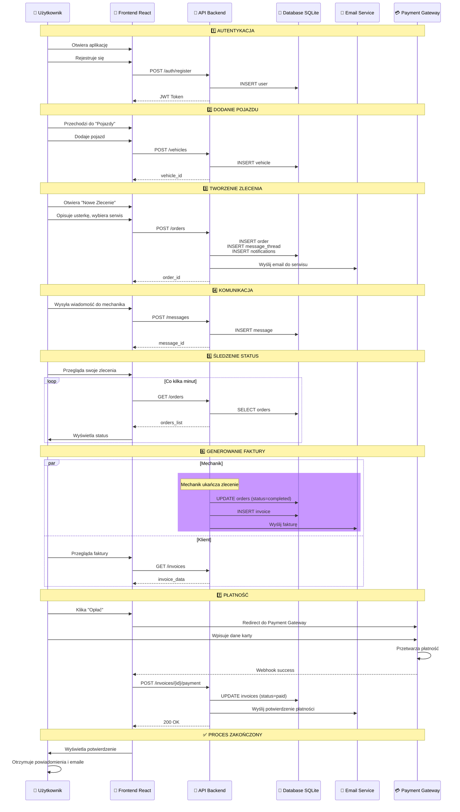
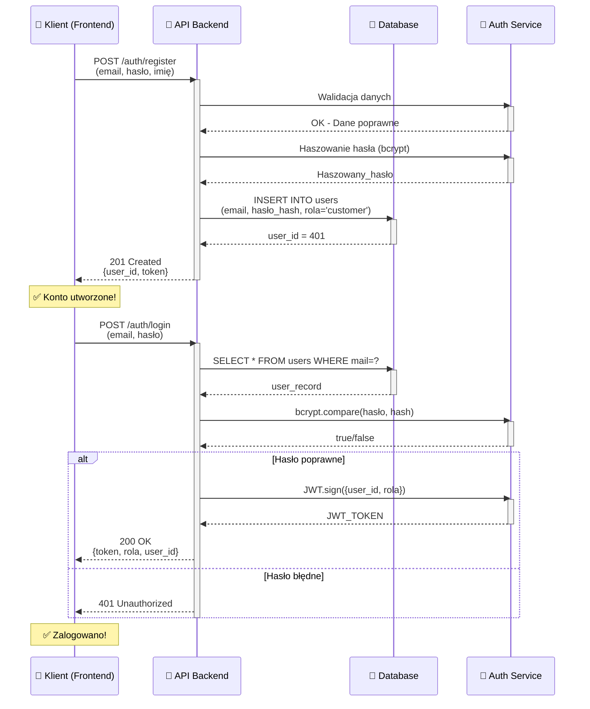
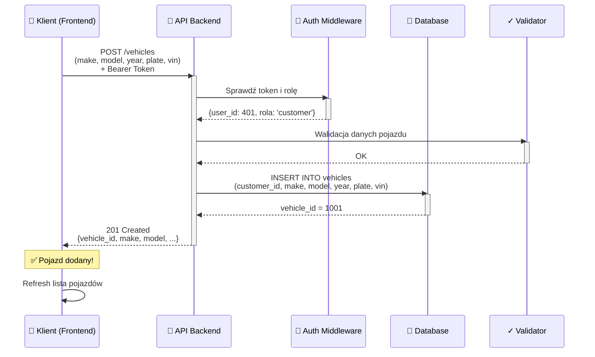
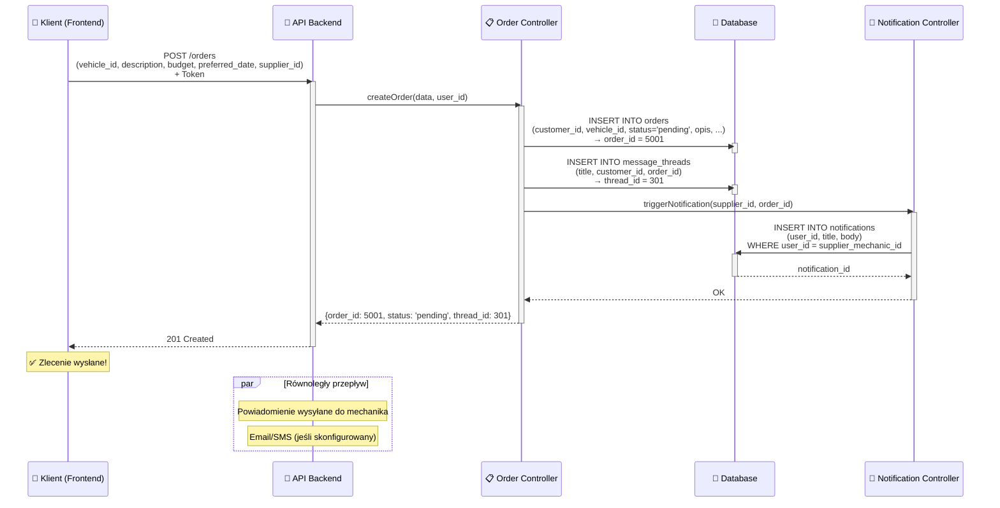
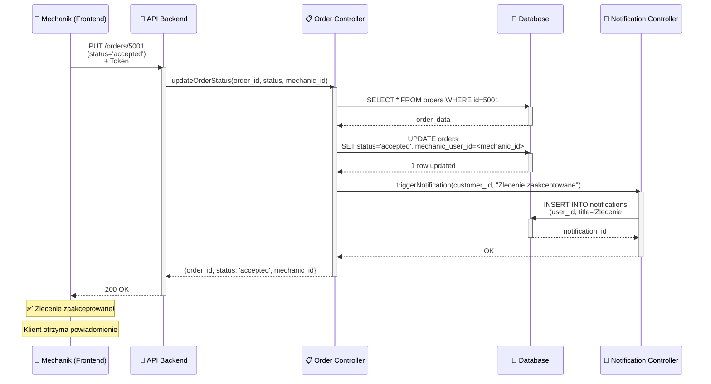
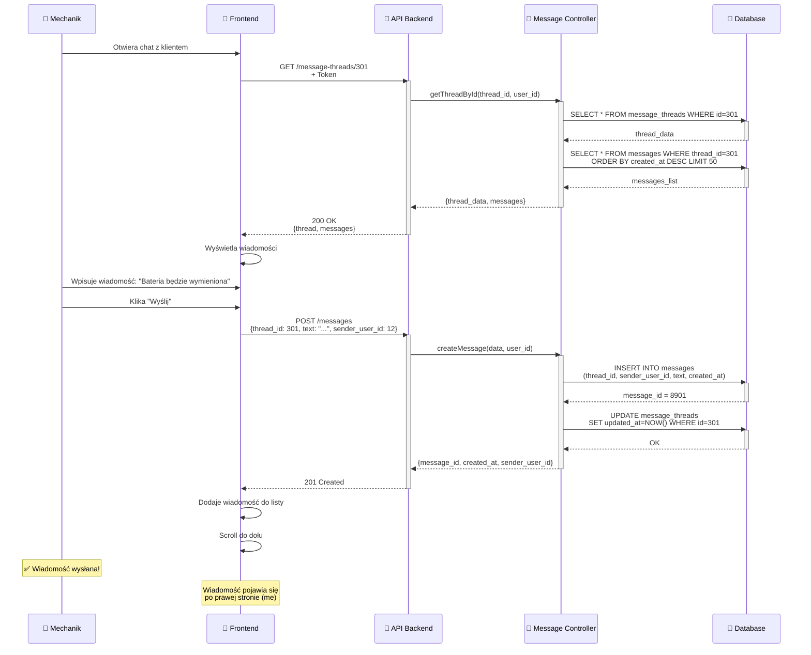
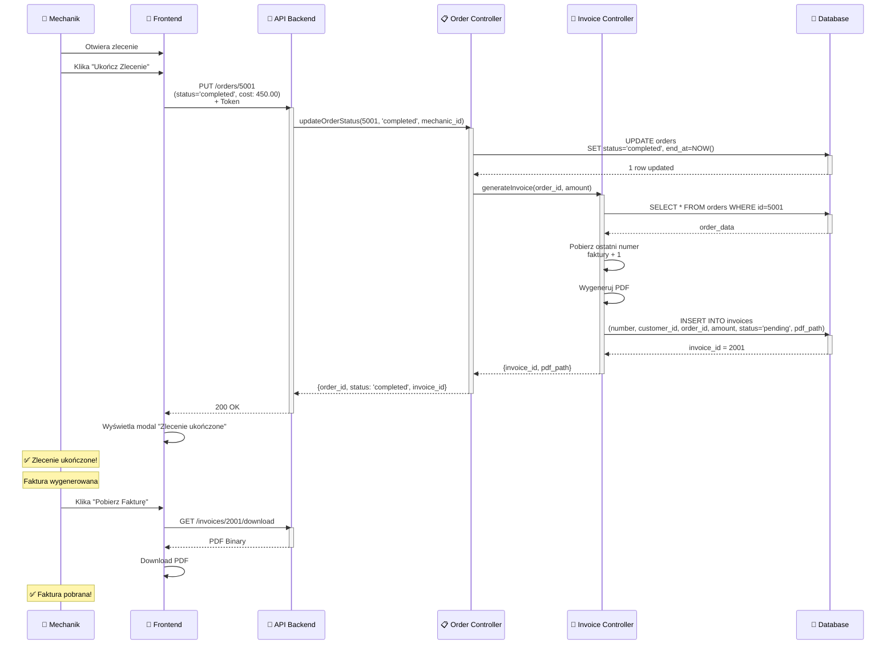
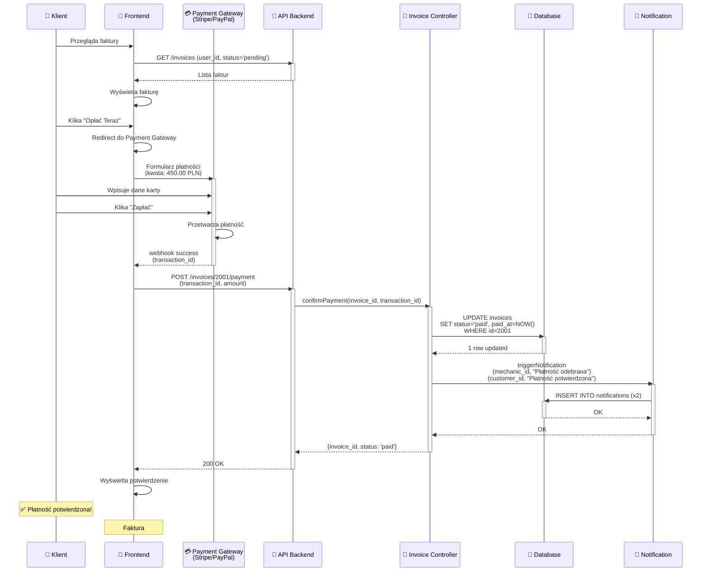
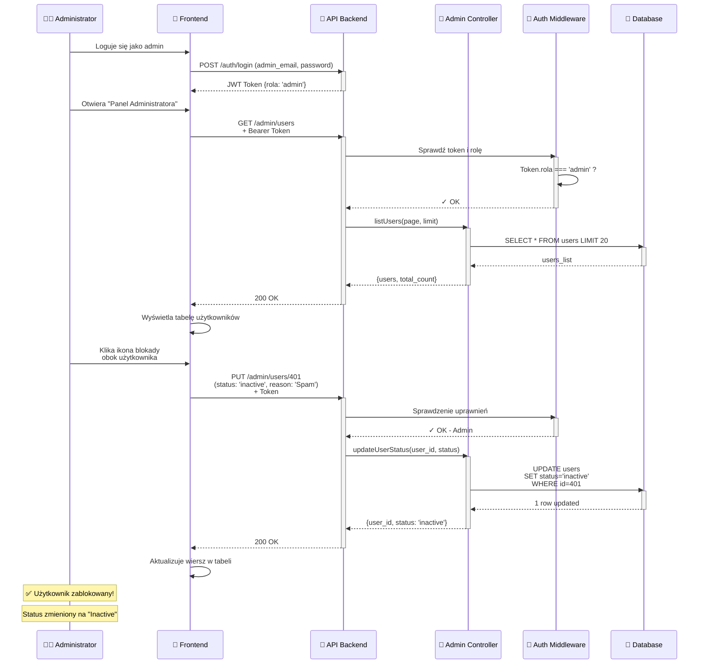
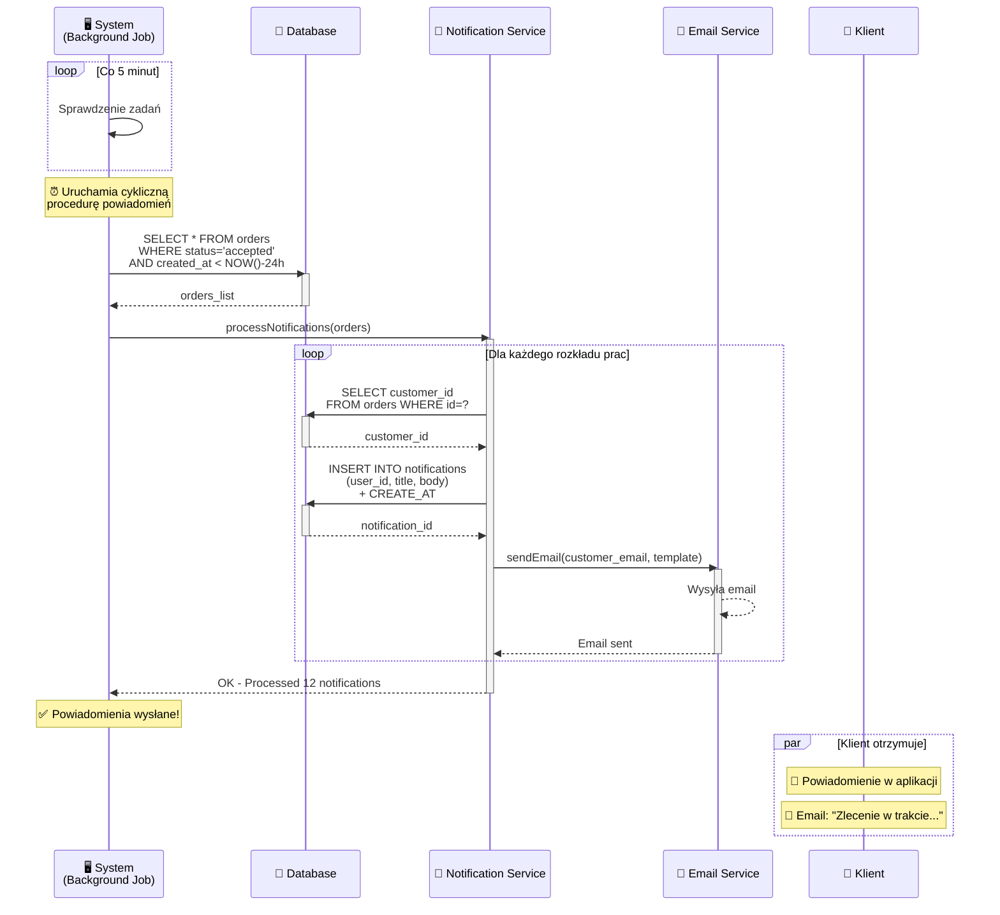

# 📈 DIAGRAM SEKWENCJI (Sequence Diagrams)

**Projekt**: AutoRepair - Platforma do zarządzania naprawami samochodów  
**Data**: Luty 2026

---

## 🎭 DIAGRAMY SEKWENCJI - MERMAID

---

## 📊 DIAGRAM 0️⃣: OGÓLNY PRZEPŁYW SYSTEMU (Complete User Journey)



**Ogólny przepływ**:
1. ✅ Rejestracja i Login
2. ✅ Dodanie pojazdu
3. ✅ Zgłoszenie usterki (zlecenie)
4. ✅ Komunikacja z mechanikiem
5. ✅ Śledzenie statusu
6. ✅ Generowanie faktury
7. ✅ Płatność
8. ✅ Potwierdzenie

---

### 1. SCENARIUSZ: REJESTRACJA I LOGOWANIE



---

### 2. SCENARIUSZ: TWORZENIE POJAZDU



---

### 3. SCENARIUSZ: KLIENT TWORZY ZLECENIE



---

### 4. SCENARIUSZ: MECHANIK AKCEPTUJE ZLECENIE



    ---

    ### 4A. SCENARIUSZ: RECEPCJA TWORZY ZLECENIE Z WIZYTY I PRZYPISUJE MECHANIKA

    ```mermaid
    sequenceDiagram
        participant Reception as 🧑‍💼 Recepcja
        participant Frontend as 📱 Frontend
        participant API as 🔗 API Backend
        participant DB as 💾 Database

        Reception->>Frontend: Otwiera szczegóły wizyty
        Frontend->>API: GET /appointments/:id
        API->>DB: SELECT appointment
        API-->>Frontend: appointment

        Reception->>Frontend: Pobiera listę mechaników
        Frontend->>API: GET /users/mechanics
        API->>DB: SELECT users WHERE rola='mechanik'
        API-->>Frontend: mechanics_list

        Reception->>Frontend: Wybiera mechanika i klika "Utwórz zlecenie"
        Frontend->>API: POST /orders<br/>(customer_id, vehicle_id, service, mechanic_user_id)
        API->>DB: INSERT order
        API-->>Frontend: order_id

        Frontend->>API: PATCH /appointments/:id<br/>(order_id)
        API->>DB: UPDATE appointments
        API-->>Frontend: OK

        Frontend->>Reception: Przekierowanie do zleceń
    ```

---

### 5. SCENARIUSZ: WYSŁANIE WIADOMOŚCI



---

### 6. SCENARIUSZ: UKOŃCZENIE ZLECENIA I GENEROWANIE FAKTURY



---

### 7. SCENARIUSZ: KLIENT OPŁACA FAKTURĘ



---

### 8. SCENARIUSZ: ADMIN ZARZĄDZA UŻYTKOWNIKAMI



---

### 9. SCENARIUSZ: SYSTEM WYSYŁA POWIADOMIENIA



---

## 📊 LEGENDA DIAGRAMÓW

### Symbole
- **→** : Synchroniczne wywołanie (wait for response)
- **-->>** : Zwrot/Response
- **rect** : Sekcja kodu (Alternative, Loop, itp.)
- **par** : Równoległy przepływ (parallel execution)
- **activate** : Aktywacja komponentu
- **deactivate** : Deaktywacja komponentu

### Kolory (zależnie od ustawień)
- 🔗 API - Backend
- 💾 Database - SQLite3
- 📱 Frontend - React
- 👤 Aktor - Użytkownik
- 🔐 Auth - Middleware
- 📊 Controller - Business logic

---

## 🎯 GŁÓWNE PRZEPŁYWY

| # | Scenariusz | Uczestnikami | Kluczowe Akcje |
|---|-----------|--------------|-----------------|
| 1 | Rejestracja | Klient ↔ API ↔ DB | Walidacja, Haszowanie, Zapis |
| 2 | Pojazd | Klient ↔ API ↔ DB | Walidacja, INSERT |
| 3 | Zlecenie | Klient ↔ API ↔ DB | INSERT order + thread + notif |
| 4 | Akceptacja | Mechanik ↔ API ↔ DB | UPDATE status + notif |
| 5 | Wiadomości | Mechanik ↔ API ↔ DB | INSERT message |
| 6 | Faktura | Mechanik ↔ API ↔ DB | UPDATE status + INSERT invoice |
| 7 | Płatność | Klient ↔ PaymentGW ↔ API | Przetworzy płatność + UPDATE |
| 8 | Admin | Admin ↔ API ↔ DB | RBAC check + UPDATE user |
| 9 | Powiadomienia | System ↔ API ↔ DB | Background job + Email |

---

## 🔄 TIMING & PERFORMANCE

### Szacunkowe Czasy Odpowiedzi

```
Rejestracja: 200-500ms
├─ Walidacja: 50ms
├─ Haszowanie (bcrypt): 100-200ms
└─ INSERT: 50-150ms

Login: 150-350ms
├─ SELECT user: 50ms
├─ bcrypt.compare: 100-150ms
└─ JWT.sign: 50ms

Tworzenie Zlecenia: 300-700ms
├─ Walidacja: 50ms
├─ INSERT orders: 100ms
├─ INSERT message_thread: 100ms
└─ INSERT notifications: 100-200ms

Wysłanie Wiadomości: 150-400ms
├─ INSERT messages: 100-150ms
└─ UPDATE thread: 50-100ms

Generowanie Faktury: 500-1500ms
├─ Database ops: 200-400ms
├─ PDF generation: 300-800ms
└─ File save: 100-200ms
```

---

## 📋 CHECKLIST DIAGRAMÓW

- [x] Rejestracja i Logowanie
- [x] Tworzenie Pojazdu
- [x] Tworzenie Zlecenia
- [x] Akceptacja Zlecenia
- [x] Wysłanie Wiadomości
- [x] Ukończenie Zlecenia + Faktura
- [x] Płatność Faktury
- [x] Admin Management
- [x] System Notifications

**Razem: 9 diagramów sekwencji**

---

## 🎓 WNIOSKI

1. **Asynchroniczne procesy** - Powiadomienia mogą być wysyłane w tle
2. **Bezpieczeństwo** - Każdy request wymaga token + role check
3. **Konsystencja danych** - Transakcje logiczne (order + thread + notif)
4. **Error Handling** - Każdy diagram zakładał happy path
5. **Performance** - DB queries optymalizowane z indeksami

---

**Stworzono**: Luty 2026  
**Autor**: GitHub Copilot  
**Wersja**: 1.0

